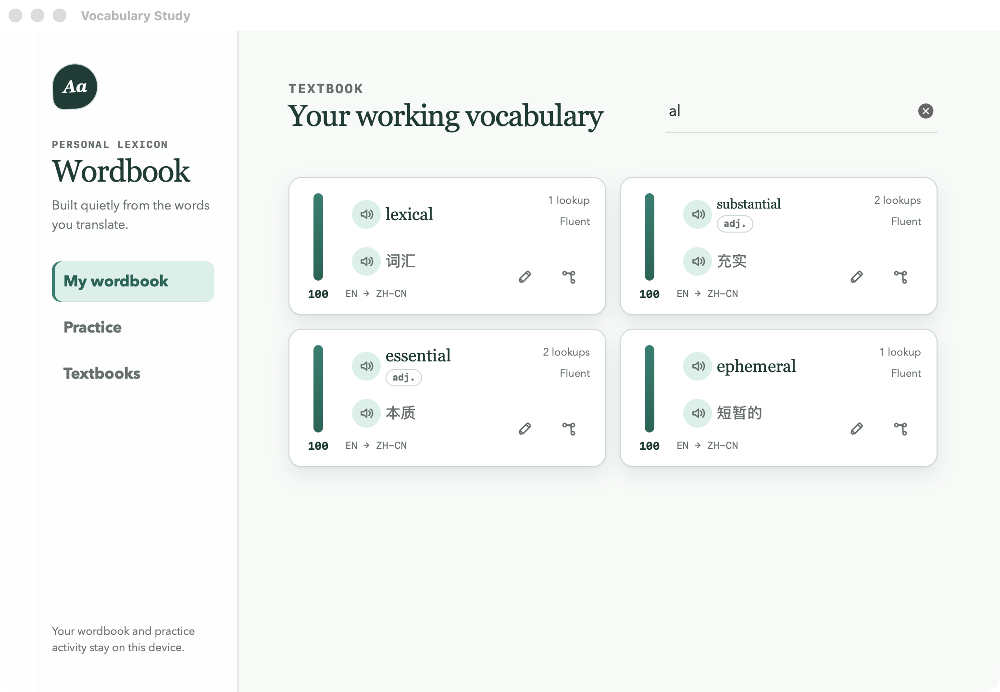
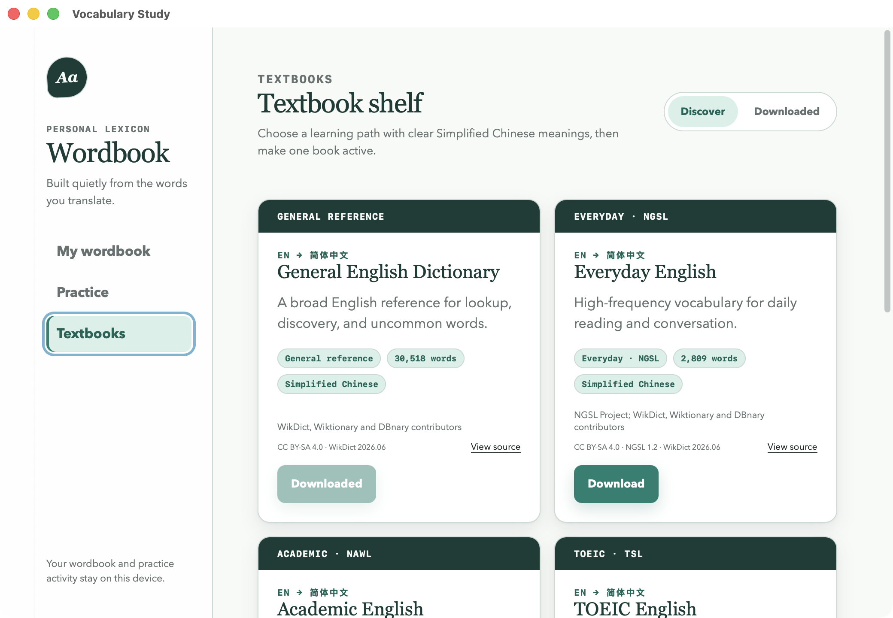
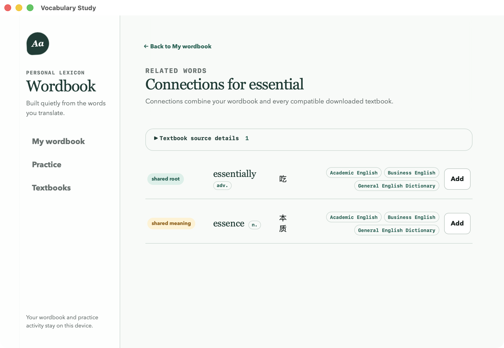

<div align="center">


# Desktop Translator

**Select text anywhere on your desktop and translate it in place.**

[](https://github.com/Ldsystem/desktop-translator/actions/workflows/ci.yml)
[](https://github.com/Ldsystem/desktop-translator/releases/latest)
[](https://github.com/Ldsystem/desktop-translator/releases)
[](LICENSE)
[](#platform-support)
[](https://tauri.app)

</div>

<div align="center"><a href="README.zh-CN.md">简体中文</a> · English</div>

Highlight a word or a sentence in any application. When you release the mouse, a
small translate button appears beside the selection; click it and the
translation opens right there, without stealing focus from what you were
reading.

It is the convenience of a browser translation extension, except it works in
your mail client, your PDF reader, and your terminal — not just in a browser
tab.

## Features

- **Translate from any application.** Selection is read through the operating
  system's accessibility layer, so it works in native controls and in embedded
  web surfaces alike.
- **Never steals focus.** The button and the result render in a non-activating
  overlay, so the window you were reading stays active.
- **Automatic language detection**, with a source-language override on the
  result when the guess is wrong.
- **Spoken pronunciation** for both the original and the translation, using the
  operating system's built-in voices.
- **Quick translate panel.** Click the menu-bar icon to type or paste text
  directly, without selecting anything.
- **Local vocabulary study.** Eligible translated words and short phrases build
  a private on-device wordbook with pronunciation, recall tracking, related-word
  discovery, downloaded textbooks, and bidirectional practice.
- **Stays out of the way.** Lives in the menu bar with no Dock icon, and can
  start at login.
- **English and Simplified Chinese UI.** Switch immediately from Settings or
  the menu-bar menu, with CJK typography tuned for desktop reading.
- **Choose your translation service.** Google Cloud, Baidu Translate, and
  Microsoft Translator (global or China cloud) share one provider-neutral
  native boundary. Provider credentials stay in isolated system-vault slots.

Languages: English, Chinese (Simplified), Japanese, Korean, French, German and
Spanish, in any direction, plus automatic detection of the source.

## Vocabulary Study

Every eligible word or short phrase you translate can become part of a private,
on-device learning loop. Repeated lookups measure demand; submitted practice
answers measure recall. Sentence-like selections are translated normally but
are never added to the wordbook.



The study window brings four tools together:

- **My wordbook** keeps the source and translation, language direction, lookup
  demand, recall score, pronunciation controls, and provenance-backed
  part-of-speech metadata. Entries can be corrected or removed.
- **Downloaded textbooks** start with an embedded offline Simplified Chinese
  starter and provide five additional learning paths,
  including everyday, academic, TOEIC, business, and general-reference
  vocabulary. A textbook hit is copied into your personal wordbook.
- **Related words** combines roots and shared meanings across your wordbook and
  compatible downloaded textbooks, shows where every result came from, and lets
  you add useful connections with one click.
- **Practice** tests word-to-meaning, meaning-to-word, or a random mix. Related
  words and the active textbook supply more challenging distractors, while
  mastered words leave the active queue until their recall fades.

<table>
  <tr>
    <td width="50%"></td>
    <td width="50%"></td>
  </tr>
  <tr>
    <td align="center"><sub>Choose a focused Simplified Chinese textbook.</sub></td>
    <td align="center"><sub>Explore connections across personal and downloaded vocabulary.</sub></td>
  </tr>
</table>

> [!NOTE]
> Translation lookup follows a local-first order: personal wordbook → active
> downloaded textbook → configured online translation provider.

## Platform support

| Platform | Status |
| --- | --- |
| macOS 11+ | Supported |
| Windows 10/11 | Implemented but unqualified — not distributed yet |
| Linux | Not planned |

> [!NOTE]
> The Windows adapters (UI Automation selection, low-level mouse hook, SAPI
> speech) are written and compile in CI, but they have never been exercised on a
> real Windows host, so no Windows build is published. See
> [`docs/platform-test-matrix.md`](docs/platform-test-matrix.md) for what is and
> is not qualified.

## Install

Download the `.dmg` from the
[latest release](https://github.com/Ldsystem/desktop-translator/releases/latest)
and drag the app into Applications. The build is universal, so one download
runs natively on both Apple Silicon and Intel Macs.

> [!IMPORTANT]
> Releases are **not signed with an Apple Developer ID**, so Gatekeeper will
> refuse the first launch. Clear the quarantine flag to allow it:
>
> ```sh
> xattr -dr com.apple.quarantine "/Applications/Desktop Translator.app"
> ```

## Setup

Two things are needed before the first online translation. Vocabulary Study is
usable immediately because its starter English → Simplified Chinese textbook is
embedded in the app.

**1. Grant Accessibility permission.** The app reads the selected text and its
on-screen position through the macOS Accessibility API. On first launch it will
point you at *System Settings → Privacy & Security → Accessibility*; enable
Desktop Translator there, then **quit the app from the menu bar and open it
again**. macOS does not apply a new Accessibility grant to a process that is
already running, which is why the warning can remain after the switch is on.

> [!IMPORTANT]
> Releases are ad-hoc signed, so the code identity changes with every version.
> macOS ties an Accessibility grant to that identity, which means an update
> silently invalidates the old grant even though the switch still looks enabled.
> After updating, remove the stale Desktop Translator entry from the
> Accessibility list and add the new app again.

> [!NOTE]
> No screen capture is involved and no Screen Recording permission is requested.
> The app reads only the text you selected, only after you finish selecting it.

**2. Choose and configure a translation provider.** Open Settings from the
menu-bar menu, choose a service, and use its native credential prompt:

| Provider | Configuration | Network note |
| --- | --- | --- |
| Baidu Translate | APP ID + secret key | Recommended for users in mainland China |
| Microsoft Translator | Subscription key, cloud profile, optional region | China cloud requires an Azure China account |
| Google Cloud | Cloud Translation API key | Availability depends on the user's network |

> [!TIP]
> Restrict each credential to translation, and set the provider's quota or
> budget. Requests use only the service currently selected in Settings; the app
> never silently falls back to another online provider.

Credentials are entered in native secure prompts and stored in the macOS
Keychain. They never pass through the WebView and are never written to the
settings file.

## Usage

| Action | Result |
| --- | --- |
| Select text, then release the mouse | A translate button appears beside the selection |
| Click the button | The translation opens in place |
| Change the source language on the result | Retranslates with the language you chose |
| Click the speaker icon | Speaks the text with a system voice |
| Click the menu-bar icon | Opens the quick translate panel for typed text |
| Open Vocabulary Study from the menu-bar menu | Reviews your wordbook, textbooks, connections, and practice queue |
| Menu-bar right-click | Settings, UI language, enable/disable, start at login, quit |

Nothing is sent anywhere until you click the translate button. Selections in
password and other secure fields are ignored. Eligible words and short lexical
phrases, their successful translations, lookup counts, and submitted practice
results are stored locally in the application's SQLite database. Sentence-like
text is never added to the wordbook. The database is not exposed to the
interface and is not synchronized to a cloud service.

Downloaded textbook files and related-word discovery stay on this device.
Connections combine conservative root matching with shared meanings from the
personal wordbook and compatible downloaded textbooks. The feature does not use
an LLM or embeddings. Textbook attribution and source links remain visible in
the interface.

## 隐私与本地学习记录

应用只有在你主动点击翻译后才会调用翻译服务。密码框等安全控件中的内容会被忽略。
符合条件的单词和短词组、成功的翻译结果、查询次数以及已提交的练习结果会保存在本机的
SQLite 数据库中，用于词汇本和复习排序；句子式文本不会写入词汇本。数据库不会暴露给
界面层，也不会同步到云端。只有主动提交练习答案才会改变记忆分数，重复查询只会记录
查询需求。下载的简体中文词书与相关词检索都保留在本机；翻译查询会依次使用个人词汇本、
当前启用的下载词书和在线翻译服务。

## Development

**Prerequisites:** Node.js 20+, [pnpm](https://pnpm.io) 10+, and a stable Rust
toolchain. Everything else comes from the lockfiles.

```sh
pnpm install
pnpm tauri dev
```

| Command | Purpose |
| --- | --- |
| `pnpm tauri dev` | Run the app against a live-reloading renderer |
| `pnpm check` | Typecheck, frontend tests, and renderer build |
| `pnpm test:platform` | Rust unit and integration tests |
| `pnpm tauri build` | Produce a `.app` and `.dmg` |

> [!TIP]
> On macOS, run [`tools/macos/create-dev-signing-identity.sh`](tools/macos/create-dev-signing-identity.sh)
> once. Development builds are otherwise ad-hoc signed with a new identity on
> every rebuild, which makes macOS forget the Keychain and Accessibility grants
> and prompt you again after each change. See
> [`docs/macos-development-signing.md`](docs/macos-development-signing.md).

### How it is put together

A Rust core owns everything that touches the operating system; a React renderer
owns only what is drawn.

```
src/                        React renderer (overlay, settings, quick panel)
  contracts/ipc.ts          IPC contract, mirrored by src-tauri/src/contracts.rs
  state/overlayMachine.ts   Overlay lifecycle reducer
src-tauri/src/
  coordinator.rs            Selection and overlay state machine
  overlay.rs, placement.rs  Non-activating window and monitor-aware positioning
  platform/macos, windows   Accessibility, pointer, speech and window adapters
  services/                 Settings, credential vault, translation provider
docs/                       Platform qualification and development notes
```

The renderer is never given provider credentials, never reads the selection itself, and
communicates only through a narrow set of validated commands.

## Acknowledgements

Built with [Tauri 2](https://tauri.app), React and Rust. Online translation
adapters support [Google Cloud](https://cloud.google.com/translate),
[Baidu Translate](https://fanyi-api.baidu.com/), and
[Microsoft Translator](https://learn.microsoft.com/azure/ai-services/translator/).
