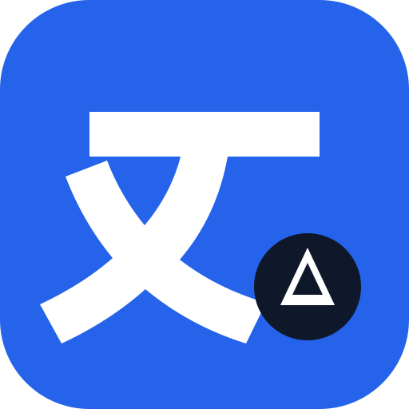

<div align="center">



# Desktop Translator

**Select text anywhere on your desktop and translate it in place.**

[](https://github.com/Ldsystem/desktop-translator/actions/workflows/ci.yml)
[](https://github.com/Ldsystem/desktop-translator/releases/latest)
[](https://github.com/Ldsystem/desktop-translator/releases)
[](LICENSE)
[](#platform-support)
[](https://tauri.app)

</div>

Highlight a word or a sentence in any application. When you release the mouse, a
small translate button appears beside the selection; click it and the
translation opens right there, without stealing focus from what you were
reading.

It is the convenience of a browser translation extension, except it works in
your mail client, your PDF reader, and your terminal — not just in a browser
tab.

## Features

- **Translate from any application.** Selection is read through the operating
  system's accessibility layer, so it works in native controls and in embedded
  web surfaces alike.
- **Never steals focus.** The button and the result render in a non-activating
  overlay, so the window you were reading stays active.
- **Automatic language detection**, with a source-language override on the
  result when the guess is wrong.
- **Spoken pronunciation** for both the original and the translation, using the
  operating system's built-in voices.
- **Quick translate panel.** Click the menu-bar icon to type or paste text
  directly, without selecting anything.
- **Stays out of the way.** Lives in the menu bar with no Dock icon, and can
  start at login.
- **Bring your own key.** Your Google Cloud Translation API key is stored in the
  system Keychain and never reaches the interface layer.

Languages: English, Chinese (Simplified), Japanese, Korean, French, German and
Spanish, in any direction, plus automatic detection of the source.

## Platform support

| Platform | Status |
| --- | --- |
| macOS 11+ | Supported |
| Windows 10/11 | Implemented but unqualified — not distributed yet |
| Linux | Not planned |

> [!NOTE]
> The Windows adapters (UI Automation selection, low-level mouse hook, SAPI
> speech) are written and compile in CI, but they have never been exercised on a
> real Windows host, so no Windows build is published. See
> [`docs/platform-test-matrix.md`](docs/platform-test-matrix.md) for what is and
> is not qualified.

## Install

Download the `.dmg` for your Mac from the
[latest release](https://github.com/Ldsystem/desktop-translator/releases/latest)
— `aarch64` for Apple Silicon, `x64` for Intel — and drag the app into
Applications.

> [!IMPORTANT]
> Releases are **not signed with an Apple Developer ID**, so Gatekeeper will
> refuse the first launch. Clear the quarantine flag to allow it:
>
> ```sh
> xattr -dr com.apple.quarantine "/Applications/Desktop Translator.app"
> ```

## Setup

Two things are needed before the first translation.

**1. Grant Accessibility permission.** The app reads the selected text and its
on-screen position through the macOS Accessibility API. On first launch it will
point you at *System Settings → Privacy & Security → Accessibility*; enable
Desktop Translator there.

> [!NOTE]
> No screen capture is involved and no Screen Recording permission is requested.
> The app reads only the text you selected, only after you finish selecting it.

**2. Add a Google Cloud Translation API key.** Open Settings from the menu-bar
menu and choose *Save API Key*. You will need a key from Google Cloud with the
Cloud Translation API enabled and billing configured.

> [!TIP]
> Restrict the key to the Cloud Translation API and set a quota or budget in
> Google Cloud. The key is yours and every request is billed to your account.

The key is entered in a native secure prompt and stored in the macOS Keychain.
It never passes through the user interface layer, is never written to the
settings file, and is sent only in the `x-goog-api-key` header over HTTPS.

## Usage

| Action | Result |
| --- | --- |
| Select text, then release the mouse | A translate button appears beside the selection |
| Click the button | The translation opens in place |
| Change the source language on the result | Retranslates with the language you chose |
| Click the speaker icon | Speaks the text with a system voice |
| Click the menu-bar icon | Opens the quick translate panel for typed text |
| Menu-bar right-click | Settings, enable/disable, start at login, quit |

Nothing is sent anywhere until you click the translate button. Selections in
password and other secure fields are ignored, and no translation history is
kept.

## Development

**Prerequisites:** Node.js 20+, [pnpm](https://pnpm.io) 10+, and a stable Rust
toolchain. Everything else comes from the lockfiles.

```sh
pnpm install
pnpm tauri dev
```

| Command | Purpose |
| --- | --- |
| `pnpm tauri dev` | Run the app against a live-reloading renderer |
| `pnpm check` | Typecheck, frontend tests, and renderer build |
| `pnpm test:platform` | Rust unit and integration tests |
| `pnpm tauri build` | Produce a `.app` and `.dmg` |

> [!TIP]
> On macOS, run [`tools/macos/create-dev-signing-identity.sh`](tools/macos/create-dev-signing-identity.sh)
> once. Development builds are otherwise ad-hoc signed with a new identity on
> every rebuild, which makes macOS forget the Keychain and Accessibility grants
> and prompt you again after each change. See
> [`docs/macos-development-signing.md`](docs/macos-development-signing.md).

### How it is put together

A Rust core owns everything that touches the operating system; a React renderer
owns only what is drawn.

```
src/                        React renderer (overlay, settings, quick panel)
  contracts/ipc.ts          IPC contract, mirrored by src-tauri/src/contracts.rs
  state/overlayMachine.ts   Overlay lifecycle reducer
src-tauri/src/
  coordinator.rs            Selection and overlay state machine
  overlay.rs, placement.rs  Non-activating window and monitor-aware positioning
  platform/macos, windows   Accessibility, pointer, speech and window adapters
  services/                 Settings, credential vault, translation provider
docs/                       Platform qualification and development notes
```

The renderer is never given the API key, never reads the selection itself, and
communicates only through a narrow set of validated commands.

## Acknowledgements

Built with [Tauri 2](https://tauri.app), React and Rust. Translation is provided
by the [Google Cloud Translation API](https://cloud.google.com/translate).
