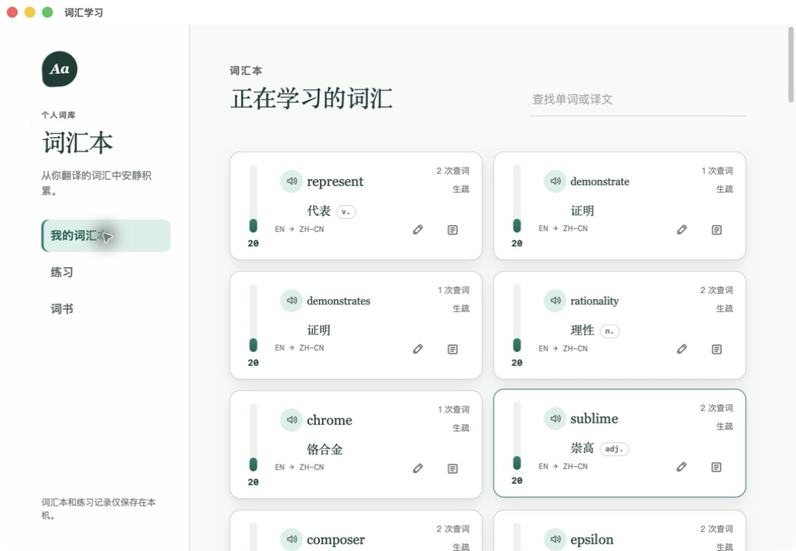
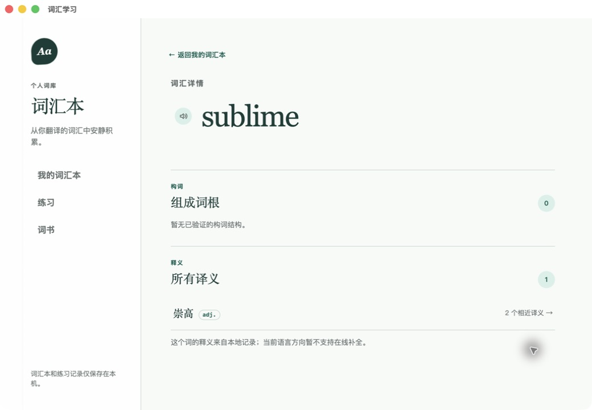
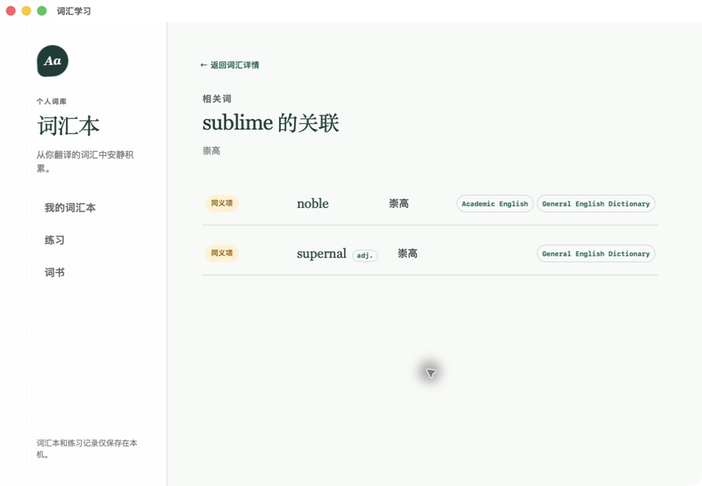
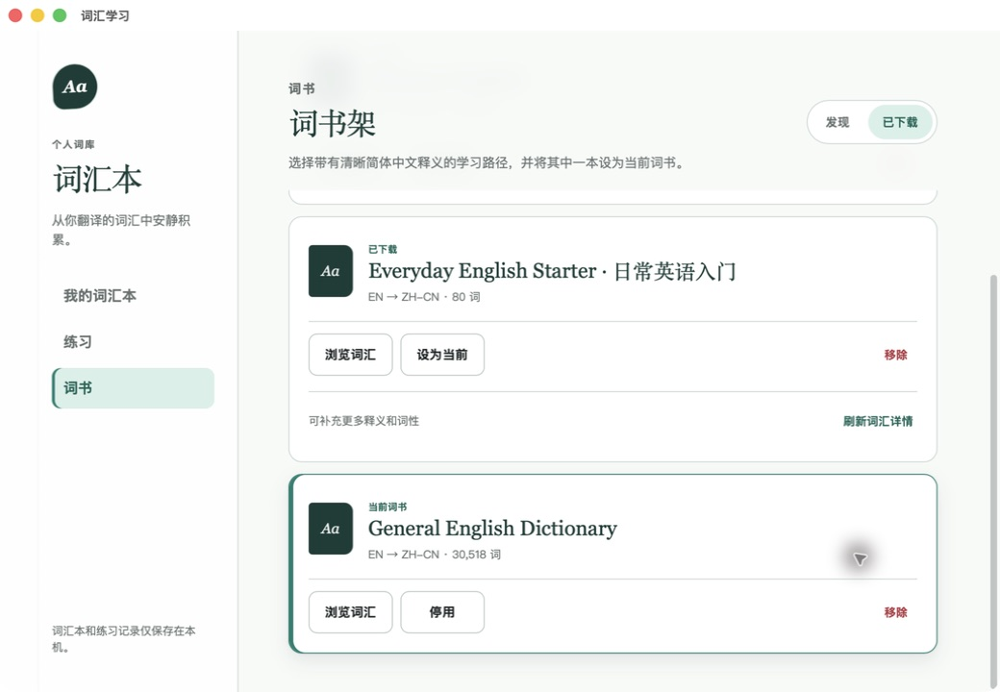

<div align="center">


# Desktop Translator

**随手翻译，积累自己的词汇本。**

[](https://github.com/Ldsystem/desktop-translator/actions/workflows/ci.yml)
[](https://github.com/Ldsystem/desktop-translator/releases/latest)
[](https://tauri.app)

[English](README.md) · 简体中文

</div>

适用于 macOS 和 Windows 的轻量桌面翻译工具，内置保存在本机的词汇学习窗口。在支持的应用中选中文字，点击旁边的翻译按钮即可查看结果；也可以从菜单栏／系统托盘打开快速翻译，手动输入或粘贴文本。

符合条件的查词会自动积累到个人词汇本。查看已保存的译义和词性，探索词书中的关联词，再通过练习巩固记忆，无须将学习记录同步到云端账号。

> [!NOTE]
> 本文对应 **0.6.0 源码实现**，下载时请确认所选发行版标签。截图于 **2026-09-03** 从本机已安装的 macOS 发布前构建实拍，使用简体中文界面和已有本地数据，不是设计稿。



## 主要功能

- **就地翻译：** 在选区附近展示结果；无法读取选区时，可使用快速翻译。
- **自主选择服务：** 支持 Google Cloud Translation、百度翻译和 Microsoft Translator，包括微软全球云及中国云端点，不会静默切换到另一家在线服务。
- **多译义与词性：** 词汇卡展示全部已保存译义及已知词性，发音按钮保留在原词旁。
- **词汇详情：** 从词汇卡进入，查看已记录例句、已验证的词根／词缀、各个译义及其关联词数量。
- **本地学习：** 内置英译简体中文入门词书，可下载更多词书，支持原词选译义、译义选原词和混合方向练习。
- **桌面体验：** 支持中英文界面、系统语音朗读、菜单栏／托盘运行及可选的开机启动。

## 安装与开始使用

从 [GitHub Releases](https://github.com/Ldsystem/desktop-translator/releases) 下载，先查看所选版本的说明和附件；并非所有历史版本都包含两个平台的安装包。

| 平台 | 安装包与支持情况 |
| --- | --- |
| macOS 11+ | 发布流程构建兼容 Apple Silicon 和 Intel 的通用应用及 DMG。将应用拖入「应用程序」后启动。当前流程使用临时签名（ad-hoc），不是 Developer ID 签名与公证。 |
| Windows 10/11 x64 | 发布流程生成未签名、仅为当前用户安装的 NSIS 安装包，可引导安装 WebView2。详见 [Windows 分发说明](docs/windows-signing-and-supply-chain.md)。 |
| Linux | 尚未实现，原生代码会拒绝 Linux 构建。 |

1. 从应用的菜单栏／托盘菜单打开「设置」。
2. macOS 划词翻译需要授予应用「辅助功能」权限；快速翻译不需要读取其他应用的选区。
3. 选择源语言和目标语言。需要在线翻译时，选择服务并配置凭据。
4. 使用测试功能确认服务配置，然后划词翻译或在快速翻译中输入文本。
5. 从菜单打开「词汇学习」，进入词汇本、练习或词书。

| 服务 | 本应用使用的配置 |
| --- | --- |
| Google Cloud Translation | Cloud Translation API 密钥，不是 Google 翻译网页版。 |
| 百度翻译 | APP ID 与密钥。 |
| Microsoft Translator | 订阅密钥、云环境，以及资源要求的区域。 |

凭据通过原生对话框输入，保存在操作系统凭据库中。可用语言与在线错误取决于所选服务。命中个人词汇本或当前词书时，可以直接使用本地译文，不必发起在线请求。

> [!IMPORTANT]
> 划词支持取决于目标应用通过辅助功能接口提供的内容。密码框、部分 PDF 阅读器、终端或自定义控件可能无法提供可用选区。本应用不会自动截屏识别或复制到剪贴板来兜底，请改用快速翻译。未签名或临时签名的安装包可能触发系统安全提示，请先确认下载来源可信，再决定是否允许打开。

## 词汇学习

### 从查词到详情

成功翻译且符合条件的单词、短词组会保存到本机；句子类选区正常翻译，但不会加入词汇本。如果辅助功能选区提供了合适的上下文句子，应用可以将其记录为该词的例句。

- **我的词汇本：** 搜索和复习词条，查看查询次数与记忆评分，修正或移除词条，并查看全部已保存译义及已知词性。
- **词汇详情：** 点击词汇卡上的详情入口，查看原词与发音、已有例句、已验证的构词结构，以及各译义对应的关联词数量。
- **相关词：** 点击某个词根或译义，只展示该分组的匹配词。返回按钮回到词汇详情。详情和相关词都是上下文页面，不占用侧栏菜单。
- **练习：** 提交答案后才更新记忆状态。重复查词只增加查询需求，不代表已经记住。多译义仍属于同一学习词条，不会拆成重复学习记录。

| 词汇详情 | 相近译义 |
| --- | --- |
|  |  |

上例当前只有一个已保存译义；词条包含更多可用译义时会一并展示。没有已验证构词数据时明确留空，不将猜测当作词源。

### 译义与关联词从哪里来

| 来源 | 当前行为 |
| --- | --- |
| 个人词汇本 | 复用已保存词条，并可合并兼容的已安装词书中的更多译义，无须联网。 |
| 当前词书 | 在在线服务之前提供本地匹配；命中词条会加入个人词汇本。 |
| Microsoft Translator | 对符合条件、且属于应用已支持词典语言对的查询，补充词典译义与词性，包括英语与简体中文方向。 |
| Google Cloud／百度 | 提供主要在线译文；其他译义可来自已安装词书，不抓取消费级翻译网页。 |
| 已验证词法数据 | 提供人工整理的词根／词缀关系。覆盖不到的单词不会仅因拼写相似就被认定为同源。 |

选择 Microsoft 且语言对受支持时，词汇详情提供在线补全译义。这是明确触发的在线操作，不是后台批量抓词。无法补全时，已有译义仍可使用。

词根或译义旁的数量，表示**所有兼容的已安装词书中匹配且去重后的单词数**，包括未设为当前的词书，但不包括原词自身。同一单词出现在多本词书中只计一次，保留各词书来源。数量与相关词页面使用相同筛选条件；个人词汇本中的匹配可作为附加信息，但不会额外增加词书词数。

> [!NOTE]
> 「全部译义」指全部可用且已保存的译义，不承诺穷尽词典。覆盖程度取决于单词、服务、语言方向和词书。旧词条可能仍只有一个译义，未知词性与词根不会凭空生成。关联匹配使用本地结构化数据，不依赖向量嵌入或大语言模型。

### 词书架

「发现」提供内置英译简体中文入门词书，以及综合词典、日常、学术、TOEIC、商务等可下载学习集合，并展示各自的署名和来源链接。

「已下载」将书名、词数与操作分区显示：浏览词汇、设为当前／停用、移除。可补充词汇信息时，「刷新词汇详情」单独放在维护行中。无法映射到有效下载来源的旧词书不会提供无效刷新。



同一时间只能有一本当前词书用于查词和练习，其他已安装词书仍可参与兼容的关联词匹配。导入仅保留经过验证且可用的词典匹配，因此下载后词数可能与原始词表大小不同。下载和刷新会校验数据包，刷新失败不会丢弃原有词书。

## 隐私与数据

- **本地保存：** 非敏感偏好存入应用配置目录的 `settings.json`；词汇、译义、例句、词书词条和练习状态存入应用数据目录的 `vocabulary.sqlite3`，不内置账号同步。
- **选区读取：** 原生辅助功能接口读取选中文字，必要时查看周围文本以提取本地例句。划词翻译不截屏、不做 OCR，也不自动复制到剪贴板。
- **网络边界：** 在线翻译将请求文本和语言方向发送给所选服务。主动补全译义、测试服务／验证凭据、获取语言列表、下载／刷新词书也可能联网。已保存例句不包含在翻译服务的请求载荷中。
- **凭据隔离：** 密钥保存在 macOS Keychain／Windows 系统凭据存储中，网页界面只接收凭据状态，不接收密钥值。
- **本地学习：** 词汇本查询、已安装词书浏览、关联匹配和练习使用本地数据。数据库由原生服务访问，再将界面需要的记录返回给前端。

## 开发与构建

原生层使用 **Tauri 2 + Rust**，界面使用 **React 19 + TypeScript + Vite**。SQLite 通过 `rusqlite` 内置，无须额外部署数据库。

准备 Node.js **22.x 的 22.12+** 或兼容的更新偶数版本、pnpm **10**、稳定版 Rust，以及对应平台的原生工具链：macOS 使用 Xcode Command Line Tools，Windows 使用 MSVC C++ 构建工具和 Windows SDK。Windows 运行还需要 WebView2。当前 Vite 也接受 Node 20.19+，不接受更早的 Node 20 版本。

```sh
git clone https://github.com/Ldsystem/desktop-translator.git
cd desktop-translator
pnpm install --frozen-lockfile
pnpm tauri dev
```

开发应用在菜单栏／托盘运行。单独执行 `pnpm dev` 只启动前端服务器，原生选区、存储、语音和凭据功能需要 Tauri 宿主。macOS 开发使用项目内的签名运行器，详见 [开发签名说明](docs/macos-development-signing.md)。

### 检查

```sh
pnpm check
pnpm test:platform
cargo fmt --manifest-path src-tauri/Cargo.toml -- --check
cargo clippy --manifest-path src-tauri/Cargo.toml --all-targets -- -D warnings
```

`pnpm check` 包含类型检查、前端测试和前端构建；`pnpm test:platform` 在当前受支持宿主上执行 Rust 测试。原生 CI 覆盖 macOS 和 Windows，但交互式划词、多显示器、语音和安装程序仍需要真机验证。[平台测试矩阵](docs/platform-test-matrix.md) 保存历史结果及手工测试项，不代表每个当前构建都已通过所有真机检查。

### 打包

```sh
pnpm tauri build
```

当前架构的安装包位于 `src-tauri/target/release/bundle/`，构建不会自动替换已安装应用。macOS 通用包需要安装两个 Rust 目标后显式构建：

```sh
rustup target add aarch64-apple-darwin x86_64-apple-darwin
pnpm tauri build --target universal-apple-darwin
```

通用包位于 `src-tauri/target/universal-apple-darwin/release/bundle/`。[发布流程](.github/workflows/release.yml) 负责双平台打包与产物检查；本地构建成功不等于完成签名、公证或公开发布。

### 代码导航

| 路径 | 职责 |
| --- | --- |
| [src/components/](src/components/) | 选区浮层、快速翻译、设置、词汇卡、详情、练习和词书界面。 |
| [src/contracts/](src/contracts/) / [src-tauri/src/contracts.rs](src-tauri/src/contracts.rs) | 前后端请求、响应、校验及错误契约。 |
| [src-tauri/src/services/](src-tauri/src/services/) | 翻译服务、凭据、设置、词汇存储、词书和学习逻辑。 |
| [src-tauri/src/platform/](src-tauri/src/platform/) | 系统选区、辅助功能、窗口及语音适配。 |
| [src-tauri/resources/](src-tauri/resources/) | 内置词书、已验证词法元数据及服务能力数据。 |
| [docs/](docs/) | 应用截图、平台验证和签名／分发说明。 |

项目基于 Tauri、React、Rust 和 SQLite。词书来源包括 WikDict／Wiktionary／DBnary 与 NGSL Project；每个集合的具体署名均保留在应用中。
